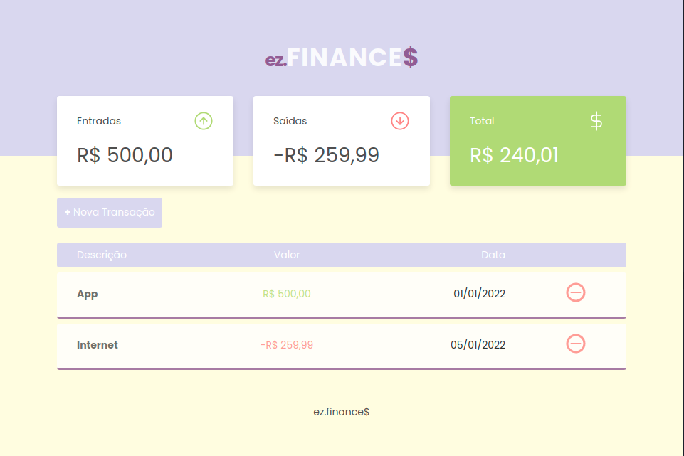

### Marcello Lopes:

# :dollar: ez-finance$

_Project Preview:_

### :tada: Please, give it a try! [Just click on this link](https://marcell0lopes.github.io/ez-finances/) and you will be redirected to the ez.FINANCE$ testing page. :tada:

### Simple web app I made to exercise some basic front-end concepts and SCSS

I've used Vanilla JS for all the functionality, like adding and removing transactions, displaying updated information on screen and using the browser's local storage to keep data.

> ### Projeto simples para aplicar e treinar conhecimentos em conceitos front-end e SCSS
>
> Eu utilizei JavaScript puro para toda funcionaliade do site. Como adicionar e remover transações, mostrar informações atualizadas na tela e manter as escolhas do usuário armazenadas no local storage.

Special thanks for Mayk Brito from Rocketseat for helping me out with the JavaScript.
